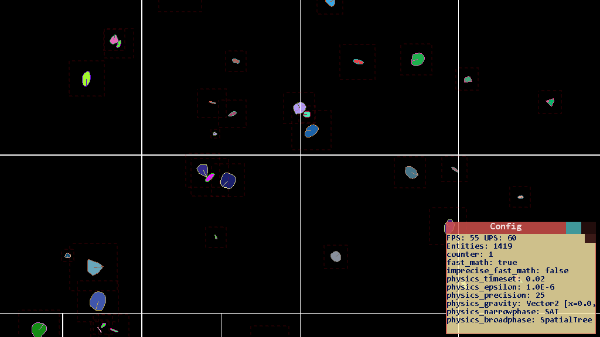
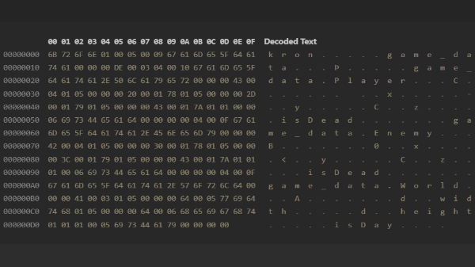

## Features
**Kronos is a open source, cross-platform game development library with a robust ecosystem.** Listed below are current and planned (\*) features:
- Assertions and logger
- Math Library
  - Math functions
  - Vector2
  - Vector3
  - Matrix2
  - Matrix3
  - Xorshift
- Standard Library (STD)
  - String Utils
  - Array Utils
  - Boolean Utils
  - Tuples (2-5)
- Serialization
- Entity Component System (ECS)
- Scene System
- Physics Library:
  - Bodies (Rigid, Soft\*)
  - Particle Physics\*
  - Seperating Axis Theorem (SAT)
  - Gilbert–Johnson–Keerthi (GJK)
  - Spatial Partitioning
  - Raycasting\*
  - Constraints\*

## Preview

